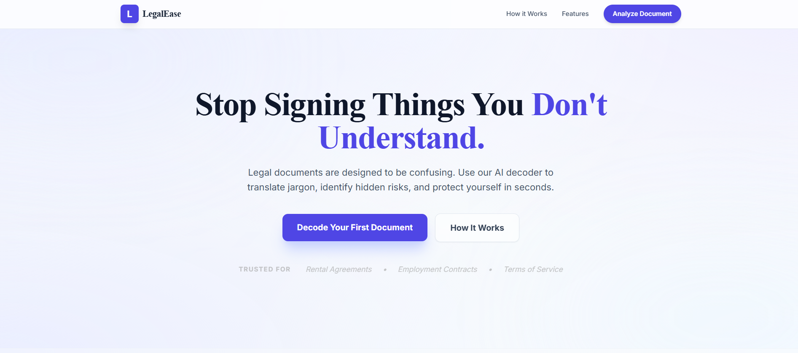

# LegalEase
<div>
   
</div>

**LegalEase Lab** is a web application that simplifies legal documents, performs risk analysis, and allows comparison between document versions. Powered by Gemini 3 Pro AI, it provides plain-English summaries, red flag detection, jargon decoding, and an interactive chat assistant for document-specific questions.

---

## Features

- **Deep Legal Analysis**: Understand complex legal documents quickly with complexity scoring and red-flag identification.
- **Document Comparison**: Compare baseline and new versions to identify added, removed, or modified clauses and their impact.
- **Multi-language Support**: English and Hindi summaries.
- **Interactive Chat**: Ask questions directly about uploaded documents.
- **Jargon Dictionary**: Explains legal terms in plain English.
- **History Tracking**: Stores recent analyses locally for easy retrieval.
- **Export Options**: Download analysis/comparison reports as Markdown or print as PDF.

---

## Tech Stack

- **Frontend**: React, TypeScript, Tailwind CSS
- **Backend**: Node.js, Express
- **AI Engine**: Gemini 3 API (Google GenAI)
- **Storage**: LocalStorage (for history)
- **File Upload**: PDF files for analysis and comparison

---

## Folder Structure
LegalEase/
├─ assets/
│ └─ Image.png
├─ src/
│ ├─ services/ # API services (geminiService.ts)
│ ├─ types.ts # TypeScript types
│ ├─ components/
│ └─ DashboardView.tsx
├─ server/ # Backend server (Node/Express)
│ └─ server.js
├─ .env # Environment variables
├─ package.json
└─ README.md

---

## Setup & Installation

### 1. Clone the repository

```bash
git clone https://github.com/your-username/legalease-lab.git
cd legalease-lab

cd my-app
npm install

cd server
npm install

PORT=5000
GENAI_API_KEY=your_genai_api_key
```
---

# Run and deploy your AI Studio app

This contains everything you need to run your app locally.

View your app in AI Studio: https://ai.studio/apps/drive/17zcOwBHvLVB_fppNiJzlUJ6H6M3p_97p

---
## Run Locally

**Prerequisites:**  Node.js

1. Install dependencies:
   `npm install`
2. Set the `GEMINI_API_KEY` in [.env.local](.env.local) to your Gemini API key
3. Run the app:
   `npm run dev`

--- 
